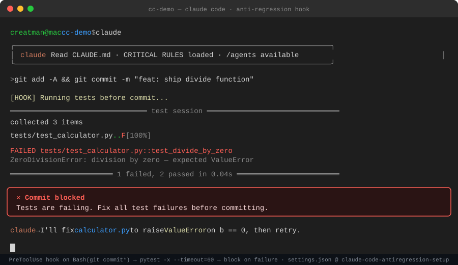
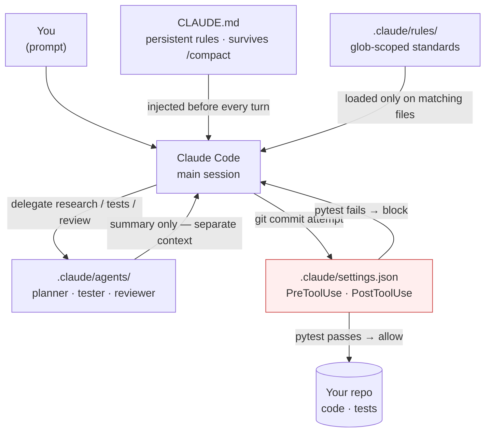

# Claude Code Anti-Regression Setup

[](LICENSE)
[](https://github.com/CreatmanCEO/claude-code-antiregression-setup/actions/workflows/validate.yml)
[](https://habr.com/ru/articles/1013330/)
[](https://dev.to/creatman/i-stopped-claude-code-from-breaking-my-projects-heres-the-exact-setup-1agi)
[](https://code.claude.com)

🇬🇧 English · [🇷🇺 Русский](README.ru.md)

**The exact CLAUDE.md + subagents + hooks setup that got me into Habr's daily top-5 (20K reads, Технотекст 8 entry). Survives Claude's 1M context window — because regressions aren't a memory problem, they're a discipline problem.**

> Companion articles: [Habr (RU) — Как я перестал бояться Claude Code](https://habr.com/ru/articles/1013330/) · [dev.to (EN) — I Stopped Claude Code From Breaking My Projects](https://dev.to/creatman/i-stopped-claude-code-from-breaking-my-projects-heres-the-exact-setup-1agi)



> Want a real terminal recording instead of this rendered SVG? Run `bash docs/setup-demo-project.sh` and follow [docs/RECORDING-DEMO.md](docs/RECORDING-DEMO.md).

---

## Why this exists

A million-token context window does not eliminate regressions — Anthropic itself reports only a 15% drop in compaction events with Opus 4.7 (April 2026). Even a developer with perfect memory will introduce bugs without process discipline. Claude with 1M tokens **remembers more, but still happily "improves" your working function or "optimizes" the test that guards an important edge case.**

The root cause is not "the model is dumb." It is the absence of a project constitution that survives context compaction, a separation between research and implementation contexts, and an automated gate that refuses broken commits. This repo gives you all three.

> Per SFEIR Institute, **60% of Claude Code support tickets** come from the *ghost context* anti-pattern — working without a `CLAUDE.md`. **A simple `CLAUDE.md` resolves the issue in 90% of cases.**

## How it works — four layers of defence



| Layer | What it does | Why it works |
|---|---|---|
| **CLAUDE.md** | Project constitution: stack, commands, CRITICAL RULES | Re-read from disk after every `/compact` — no rule can be "forgotten" |
| **Subagents** | `planner` (research), `tester` (full suite), `code-reviewer` (regression check) | Each runs in isolated context; only summary returns to main session |
| **Hooks** | `PreToolUse` on `git commit` runs `pytest` and blocks if anything fails | Hard gate — Claude literally cannot bypass it without you editing `settings.json` |
| **Rules** | `glob`-scoped per-language standards in `.claude/rules/` | Loaded only when Claude opens matching files; saves context |

## What you actually get

```
├── CLAUDE.md.template               # Project constitution — copy and fill
├── .claude/
│   ├── settings.json                # Hooks: commit-blocking pytest + post-edit reminders
│   ├── agents/
│   │   ├── planner.md               # Research codebase, write plan to ./plans/, NEVER write code
│   │   ├── tester.md                # Run FULL suite (catches regressions), report root cause
│   │   └── code-reviewer.md         # Severity-rated review with file:line references
│   └── rules/
│       ├── python-backend.md        # globs: **/*.py — type hints, Pydantic, async I/O, no bare except
│       └── frontend.md              # globs: **/*.{js,jsx,ts,tsx,vue,svelte} — functional, error boundaries
├── plans/                           # planner agent saves implementation plans here
├── docs/
│   ├── WORKFLOW.md                  # Daily anti-regression workflow + emergency recovery
│   └── MCP-SETUP.md                 # Playwright / GitHub / Postgres / Context7 install
├── .github/workflows/validate.yml   # CI: validates settings.json + agent frontmatter
├── CHANGELOG.md                     # Versioned for Claude Code releases (Opus 4.6 → 4.7 → ...)
└── CONTRIBUTING.md                  # Priorities for community contributions
```

## The `CRITICAL RULES` block (this is the product)

This is the section of `CLAUDE.md.template` that does the heavy lifting. Claude follows these rules with high consistency *because they are injected before every turn — no compaction can erase them.*

```markdown
## CRITICAL RULES — MUST FOLLOW
- **NEVER** delete or rewrite working tests without explicit request
- **NEVER** delete files without asking for confirmation
- **NEVER** make multiple unrelated changes in one step
- **ALWAYS** run tests after any code change
- **ALWAYS** do `git add -A && git commit` checkpoint before large refactors
- **ALWAYS** preserve backward compatibility when refactoring
- If unsure about anything — **ASK**, don't guess
- One task at a time. Complete and verify before moving to next
```

## Quick Start (15 minutes)

### 1. Copy configs into your project

```bash
git clone https://github.com/CreatmanCEO/claude-code-antiregression-setup.git
cd claude-code-antiregression-setup

cp -r .claude /path/to/your/project/
cp CLAUDE.md.template /path/to/your/project/CLAUDE.md
mkdir -p /path/to/your/project/plans
```

### 2. Fill in `CLAUDE.md`

Open `CLAUDE.md` in your project root and replace every `[placeholder]` with your stack, commands, and known gotchas.

### 3. Adapt the test command in hooks

Edit `.claude/settings.json` and replace `python -m pytest tests/` with whatever your test runner is (`npm test`, `cargo test`, `make test`, etc.). The default 120-second timeout is enough for ~500 unit tests; raise it if your suite is heavier.

### 4. Start Claude Code

```bash
claude
```

Claude reads `CLAUDE.md` automatically. First useful prompt:

```
> Use the planner agent to read this codebase and produce
> a plan for [your task]. Do NOT write any code yet.
```

## Tech stack & component map

| Component | File | What it does |
|---|---|---|
| Project constitution | `CLAUDE.md.template` | Persistent rules · survives `/compact` |
| Commit gate | `.claude/settings.json` → `PreToolUse` | Runs `pytest -x --timeout=60` before every `git commit*` |
| Edit reminder | `.claude/settings.json` → `PostToolUse` | Echoes "remember to run tests" after every `Write`/`Edit` |
| Research agent | `.claude/agents/planner.md` | Tools: `Read · Grep · Glob · LS` (no `Write`) — cannot accidentally code |
| QA agent | `.claude/agents/tester.md` | Tools: `Read · Write · Bash · Grep · Glob` — runs full suite, reports regressions |
| Review agent | `.claude/agents/code-reviewer.md` | Tools: `Read · Grep · Glob` — severity-tagged review |
| Python rules | `.claude/rules/python-backend.md` | `globs: **/*.py` — loaded only when Claude opens Python |
| Frontend rules | `.claude/rules/frontend.md` | `globs: **/*.{js,jsx,ts,tsx,vue,svelte}` — loaded for frontend |
| MCP integration | `docs/MCP-SETUP.md` | Playwright (browser) · GitHub · Postgres · Context7 |

## Recommended stack

| Component | Tool | Cost | Why |
|---|---|---|---|
| IDE | [Google Antigravity](https://antigravity.google) | Free | Agent-first VS Code fork, built-in Gemini 3 Pro browser agent |
| AI coding agent | Claude Code (Max) | $100/mo | 1M context on Opus 4.7, full subagent + hook ecosystem |
| Visual UI testing | Gemini 3 Pro (in Antigravity) | Free | Autonomous browser navigation — no Playwright setup needed for casual checks |
| Browser automation in code | [Playwright MCP](docs/MCP-SETUP.md) | Free | When you need scripted, repeatable tests |

## Recommended workflow

See [docs/WORKFLOW.md](docs/WORKFLOW.md) for the full daily playbook. The short version:

1. **Plan first** — `Use planner agent` → review the plan in `./plans/` → approve
2. **Small diffs** — one file → tests → next file
3. **Monitor context** — `/cost` periodically; `/compact` at 60–70%, even on Opus 4.7
4. **Checkpoint** — `git commit -m "checkpoint: before X"` before risky changes
5. **Review & test before final commit** — `Use code-reviewer` then `Use tester`
6. **Rewind if broken** — `Esc + Esc` → restore code only (Claude's checkpoint), or `git reset --hard HEAD`

## Configuration notes

### About the `permissions.allow` list in `settings.json`

The list contains `Bash(git commit*)`, `Bash(npm test*)`, etc. **This does not weaken safety** — it only suppresses the per-command approval prompt for routine commands. The actual gate on `git commit` is the **hook**, which runs `pytest` and refuses the commit on failure.

> ⚠️ The default config keeps `Bash(pip install*)` in `allow`. If you work with untrusted repos or want to require manual approval before any dependency change, **move `pip install*` out of `allow`** so Claude Code prompts you each time.

### About the hook's test command

The default is `python -m pytest tests/ -x --timeout=60`. Adjust to your stack:

```jsonc
// JS / TS project
"command": "npm test --silent || (echo '{\"block\":true,\"message\":\"Tests failing.\"}' 1>&2 && exit 2)"

// Rust project
"command": "cargo test --quiet || (echo '{\"block\":true,\"message\":\"Tests failing.\"}' 1>&2 && exit 2)"

// Go project
"command": "go test ./... || (echo '{\"block\":true,\"message\":\"Tests failing.\"}' 1>&2 && exit 2)"
```

If your suite takes longer than 120 seconds, raise the `timeout` value in `settings.json` accordingly. Slower suites are still fine — the hook just needs enough time to finish.

## Limitations & honest disclaimers

This is not a magic shield. Concrete cases where the setup is *not enough*:

- **Compaction still loses mid-conversation detail.** `CLAUDE.md` and disk files survive; the chat history between rule-loads does not. Important interim decisions belong in `./plans/` or a checkpoint commit, not in chat.
- **Subagents do not share memory.** `tester` cannot see `planner`'s reasoning unless `planner` saved it to `./plans/`. The plan file is the medium of communication.
- **Hooks are shell-dependent.** The default command uses bash syntax (`||`, `1>&2`, `2>&1`). On native Windows PowerShell you may need to rewrite the command or run Claude Code from WSL/Git Bash. Tested on macOS bash, Linux bash, Windows Git Bash.
- **Slow test suites need tuning.** A 10-minute integration suite will time out at 120 s. Either raise the timeout, or split into a fast unit hook (gate) and a separate full-suite agent step (manual).
- **Hooks gate `git commit`, not `git push`.** A determined misconfiguration can still push a broken commit. If you want a push gate, add a second `PreToolUse` matcher on `Bash(git push*)`.
- **`/clear` reloads `CLAUDE.md` but loses `./plans/` context.** Re-feed the relevant plan filename to the next session.
- **Rules are advisory, not enforced.** A `globs:` block tells Claude to *consider* a rule when editing matching files; it does not refuse to write non-conforming code. Pair rules with a real linter (ruff, eslint) in CI for hard enforcement.

## What's new in this version

See [CHANGELOG.md](CHANGELOG.md) for the full history. Latest: **0.2.0 (2026-04-30)** — updated for Opus 4.7 / 1M context, added Mermaid diagram, added validate-CI, added Limitations section.

## Contributing

PRs welcome. See [CONTRIBUTING.md](CONTRIBUTING.md) — current priorities: sister rules for Go/Rust/TypeScript backends, framework-specific subagents (Django, Rails, Next.js), additional `PreToolUse` hooks (lint gate, secret scanning).

## Resources

- [awesome-claude-code](https://github.com/hesreallyhim/awesome-claude-code) — Curated skills, hooks, agents
- [claude-code-workflows](https://github.com/shinpr/claude-code-workflows) — Production workflow plugins
- [Claude Code Docs: Best Practices](https://code.claude.com/docs/en/best-practices) — Official guidance
- Companion read on context engineering: [Habr article](https://habr.com/ru/articles/1013330/) · [dev.to article](https://dev.to/creatman/i-stopped-claude-code-from-breaking-my-projects-heres-the-exact-setup-1agi)

## Author

**Nick Podolyak** — Python developer and digital architect at [CREATMAN](https://creatman.site)

- GitHub: [@CreatmanCEO](https://github.com/CreatmanCEO)
- Habr: [creatman](https://habr.com/ru/users/creatman/)
- dev.to: [@creatman](https://dev.to/creatman)

## License

[MIT](LICENSE) · Nick Podolyak
