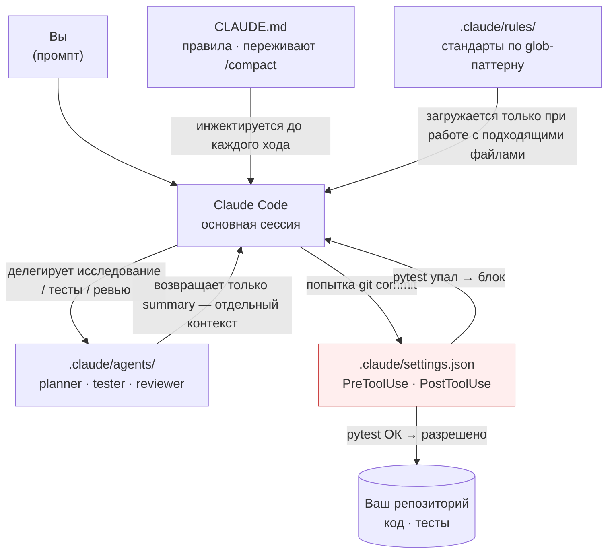

# Claude Code Anti-Regression Setup

[](LICENSE)
[](https://github.com/CreatmanCEO/claude-code-antiregression-setup/actions/workflows/validate.yml)
[](https://habr.com/ru/articles/1013330/)
[](https://dev.to/creatman/i-stopped-claude-code-from-breaking-my-projects-heres-the-exact-setup-1agi)
[](https://code.claude.com)

🇷🇺 Русский · [🇬🇧 English](README.md)

**Готовый набор `CLAUDE.md` + субагентов + хуков, с которым моя статья попала в топ-5 дня на Хабре (20K чтений, заявка на «Технотекст 8»). Работает с миллионным окном Claude — потому что регрессии — это не проблема памяти, а проблема дисциплины.**

> Статьи-сопровождения: [Habr (RU) — Как я перестал бояться Claude Code](https://habr.com/ru/articles/1013330/) · [dev.to (EN) — I Stopped Claude Code From Breaking My Projects](https://dev.to/creatman/i-stopped-claude-code-from-breaking-my-projects-heres-the-exact-setup-1agi)


> *GIF — пока заглушка. Инструкция по записи: [docs/RECORDING-DEMO.md](docs/RECORDING-DEMO.md).*

---

## Зачем это нужно

Контекстное окно в миллион токенов **не отменяет регрессии** — Anthropic сообщает лишь о 15% снижении событий compaction'а в Opus 4.7 (апрель 2026). Даже разработчик с идеальной памятью допустит баги, если у него нет процесса. Claude с 1M токенов **помнит больше, но всё ещё может «оптимизировать» вашу рабочую функцию или «улучшить» тест, охранявший важный edge case.**

Корень не в том, что «модель тупая». Корень в отсутствии трёх вещей: конституции проекта, переживающей `/compact`; разделения исследовательского и реализационного контекстов; автоматического шлюза, который отказывается коммитить сломанный код. Этот репозиторий даёт всё три.

> По данным SFEIR Institute, **60% обращений в поддержку Claude Code** вызваны паттерном *ghost context* — работой без `CLAUDE.md`. **Простой `CLAUDE.md` решает проблему в 90% случаев.**

## Как это работает — четыре уровня защиты



| Уровень | Что делает | Почему это работает |
|---|---|---|
| **CLAUDE.md** | Конституция проекта: стек, команды, CRITICAL RULES | Перечитывается с диска после каждого `/compact` — ни одно правило не «забывается» |
| **Субагенты** | `planner` (исследование), `tester` (полный прогон), `code-reviewer` (поиск регрессий) | Каждый работает в отдельном контексте; в основную сессию возвращается только summary |
| **Хуки** | `PreToolUse` на `git commit` запускает `pytest` и блокирует, если что-то упало | Жёсткий шлюз — Claude физически не может его обойти, не редактируя `settings.json` |
| **Правила** | Скоупированные по glob стандарты в `.claude/rules/` | Загружаются только когда Claude открывает соответствующий файл; экономят контекст |

## Что внутри

```
├── CLAUDE.md.template               # Конституция проекта — копируй и заполни
├── .claude/
│   ├── settings.json                # Хуки: блокировка коммита по pytest + reminder после правки
│   ├── agents/
│   │   ├── planner.md               # Исследует код, пишет план в ./plans/, НЕ КОДИТ
│   │   ├── tester.md                # Прогоняет ПОЛНЫЙ test-suite (ловит регрессии)
│   │   └── code-reviewer.md         # Ревью с severity (CRITICAL/WARNING/GOOD), file:line
│   └── rules/
│       ├── python-backend.md        # globs: **/*.py — type hints, Pydantic, async I/O
│       └── frontend.md              # globs: **/*.{js,jsx,ts,tsx,vue,svelte}
├── plans/                           # planner сохраняет планы реализации сюда
├── docs/
│   ├── WORKFLOW.md                  # Дневной workflow + emergency recovery
│   └── MCP-SETUP.md                 # Установка Playwright / GitHub / Postgres / Context7
├── .github/workflows/validate.yml   # CI: валидирует settings.json и frontmatter
├── CHANGELOG.md                     # Версионирование под релизы Claude Code (4.6 → 4.7 → ...)
└── CONTRIBUTING.md                  # Приоритеты для PR
```

## Блок `CRITICAL RULES` (это и есть продукт)

Эта секция `CLAUDE.md.template` — главная рабочая лошадка. Claude следует этим правилам с высокой консистентностью **именно потому, что они инжектируются перед каждым ходом — никакой compaction их не сотрёт.**

```markdown
## CRITICAL RULES — MUST FOLLOW
- **NEVER** удалять или переписывать рабочие тесты без явного запроса
- **NEVER** удалять файлы без подтверждения
- **NEVER** делать несколько несвязанных изменений за один шаг
- **ALWAYS** запускать тесты после любого изменения кода
- **ALWAYS** делать `git add -A && git commit` checkpoint перед крупными рефакторингами
- **ALWAYS** сохранять обратную совместимость при рефакторинге
- Если не уверен — **СПРОСИ**, не угадывай
- Одна задача за раз. Закончи и проверь, прежде чем переходить к следующей
```

## Quick Start (15 минут)

### 1. Скопировать конфиги в свой проект

```bash
git clone https://github.com/CreatmanCEO/claude-code-antiregression-setup.git
cd claude-code-antiregression-setup

cp -r .claude /path/to/your/project/
cp CLAUDE.md.template /path/to/your/project/CLAUDE.md
mkdir -p /path/to/your/project/plans
```

### 2. Заполнить `CLAUDE.md`

Открой `CLAUDE.md` в корне своего проекта и замени все `[placeholder]` на реальный стек, команды и known gotchas.

### 3. Адаптировать команду тестов в хуке

Открой `.claude/settings.json` и замени `python -m pytest tests/` на свою команду (`npm test`, `cargo test`, `make test`). Дефолтный таймаут 120 секунд хватает на ~500 unit-тестов; если у тебя медленнее — увеличь.

### 4. Запустить Claude Code

```bash
claude
```

Claude автоматически прочитает `CLAUDE.md`. Первый полезный промпт:

```
> Use the planner agent to read this codebase and produce
> a plan for [твоя задача]. Do NOT write any code yet.
```

## Карта стека и компонентов

| Компонент | Файл | Что делает |
|---|---|---|
| Конституция проекта | `CLAUDE.md.template` | Постоянные правила · переживают `/compact` |
| Шлюз коммита | `.claude/settings.json` → `PreToolUse` | Запускает `pytest -x --timeout=60` перед каждым `git commit*` |
| Reminder после правки | `.claude/settings.json` → `PostToolUse` | Напоминает запустить тесты после `Write`/`Edit` |
| Исследовательский агент | `.claude/agents/planner.md` | Tools: `Read · Grep · Glob · LS` (нет `Write`) — не может случайно закодить |
| QA-агент | `.claude/agents/tester.md` | Tools: `Read · Write · Bash · Grep · Glob` — полный прогон, отчёт по регрессиям |
| Reviewer-агент | `.claude/agents/code-reviewer.md` | Tools: `Read · Grep · Glob` — ревью с severity-рейтингом |
| Python-правила | `.claude/rules/python-backend.md` | `globs: **/*.py` — грузятся только при работе с Python |
| Frontend-правила | `.claude/rules/frontend.md` | `globs: **/*.{js,jsx,ts,tsx,vue,svelte}` |
| MCP-интеграция | `docs/MCP-SETUP.md` | Playwright (браузер) · GitHub · Postgres · Context7 |

## Рекомендуемый стек

| Компонент | Инструмент | Стоимость | Почему |
|---|---|---|---|
| IDE | [Google Antigravity](https://antigravity.google) | Бесплатно | Agent-first форк VS Code, встроенный browser-агент Gemini 3 Pro |
| AI-агент | Claude Code (Max) | $100/мес | 1M контекст на Opus 4.7, полная экосистема субагентов и хуков |
| Визуальные UI-тесты | Gemini 3 Pro (в Antigravity) | Бесплатно | Автономно навигирует браузер — Playwright не нужен для casual проверок |
| Browser-автоматизация в коде | [Playwright MCP](docs/MCP-SETUP.md) | Бесплатно | Когда нужны воспроизводимые тесты |

## Рекомендуемый workflow

Полный playbook — [docs/WORKFLOW.md](docs/WORKFLOW.md). Короткая версия:

1. **Сначала план** — `Use planner agent` → ревью плана в `./plans/` → утвердить
2. **Маленькие диффы** — один файл → тесты → следующий файл
3. **Следить за контекстом** — `/cost` периодически; `/compact` при 60–70%, даже на Opus 4.7
4. **Checkpoint** — `git commit -m "checkpoint: before X"` перед рискованными изменениями
5. **Ревью и тесты перед финальным коммитом** — `Use code-reviewer` затем `Use tester`
6. **Откат если сломалось** — `Esc + Esc` → restore code only (чекпоинт Claude'а), либо `git reset --hard HEAD`

## Заметки по конфигурации

### О списке `permissions.allow` в `settings.json`

В списке лежат `Bash(git commit*)`, `Bash(npm test*)` и т.д. **Это не ослабляет безопасность** — лишь убирает per-command подтверждение для рутинных команд. Реальный шлюз на `git commit` — это **хук**, который запускает `pytest` и отказывает при падении.

> ⚠️ В дефолтном конфиге `Bash(pip install*)` лежит в `allow`. Если работаешь с непроверенными репо или хочешь ручное подтверждение перед каждой установкой зависимости — **убери `pip install*` из `allow`**, и Claude Code будет запрашивать разрешение каждый раз.

### О команде в хуке

По умолчанию: `python -m pytest tests/ -x --timeout=60`. Под другие стеки:

```jsonc
// JS / TS
"command": "npm test --silent || (echo '{\"block\":true,\"message\":\"Tests failing.\"}' 1>&2 && exit 2)"

// Rust
"command": "cargo test --quiet || (echo '{\"block\":true,\"message\":\"Tests failing.\"}' 1>&2 && exit 2)"

// Go
"command": "go test ./... || (echo '{\"block\":true,\"message\":\"Tests failing.\"}' 1>&2 && exit 2)"
```

Если test-suite дольше 120 секунд — увеличь `timeout` в `settings.json`.

## Ограничения и честные оговорки

Это не серебряная пуля. Конкретные случаи, когда сетапа **недостаточно**:

- **Compaction всё ещё теряет детали середины разговора.** `CLAUDE.md` и файлы на диске переживают; история чата между перечитываниями правил — нет. Важные промежуточные решения должны идти в `./plans/` или checkpoint-коммит, не в чат.
- **Субагенты не делятся памятью.** `tester` не видит рассуждений `planner`'а, если тот не сохранил их в `./plans/`. Файл плана — это медиум коммуникации.
- **Хуки зависят от шелла.** Команда по умолчанию использует bash-синтаксис (`||`, `1>&2`, `2>&1`). На нативном Windows PowerShell может потребоваться переписать команду или запускать Claude Code из WSL/Git Bash. Протестировано на macOS bash, Linux bash, Windows Git Bash.
- **Медленные test-suite требуют тюнинга.** 10-минутный integration-suite таймаутнется на 120 с. Либо подними таймаут, либо раздели на быстрый unit-хук (шлюз) и отдельный шаг полного прогона через агента (вручную).
- **Хуки шлюзуют `git commit`, не `git push`.** Целеустремлённая мисконфигурация всё ещё может запушить сломанный коммит. Для шлюза на push добавь второй `PreToolUse` matcher на `Bash(git push*)`.
- **`/clear` перечитывает `CLAUDE.md`, но теряет контекст из `./plans/`.** Передай нужное имя файла плана в новую сессию.
- **Правила — рекомендация, не enforcement.** Блок `globs:` говорит Claude *учитывать* правило; он не отказывается писать код, нарушающий его. Парь правила с реальным линтером (ruff, eslint) в CI.

## Что нового

Полная история — [CHANGELOG.md](CHANGELOG.md). Последняя: **0.2.0 (2026-04-30)** — обновлено под Opus 4.7 / 1M контекст, добавлена Mermaid-диаграмма, validate-CI, секция Limitations.

## Контрибьют

PR приветствуются. См. [CONTRIBUTING.md](CONTRIBUTING.md) — текущие приоритеты: правила для Go/Rust/TypeScript-бэкендов, framework-specific субагенты (Django, Rails, Next.js), дополнительные `PreToolUse` хуки (lint gate, secret scanning).

## Ресурсы

- [awesome-claude-code](https://github.com/hesreallyhim/awesome-claude-code) — Кураторская подборка skills, hooks, agents
- [claude-code-workflows](https://github.com/shinpr/claude-code-workflows) — Production workflow-плагины
- [Claude Code Docs: Best Practices](https://code.claude.com/docs/en/best-practices) — Официальные рекомендации
- Сопровождающий материал: [статья на Хабре](https://habr.com/ru/articles/1013330/) · [статья на dev.to](https://dev.to/creatman/i-stopped-claude-code-from-breaking-my-projects-heres-the-exact-setup-1agi)

## Автор

**Николай Подоляк (Nick Podolyak)** — Python-разработчик и цифровой архитектор в [CREATMAN](https://creatman.site)

- GitHub: [@CreatmanCEO](https://github.com/CreatmanCEO)
- Habr: [creatman](https://habr.com/ru/users/creatman/)
- dev.to: [@creatman](https://dev.to/creatman)

## Лицензия

[MIT](LICENSE) · Николай Подоляк
